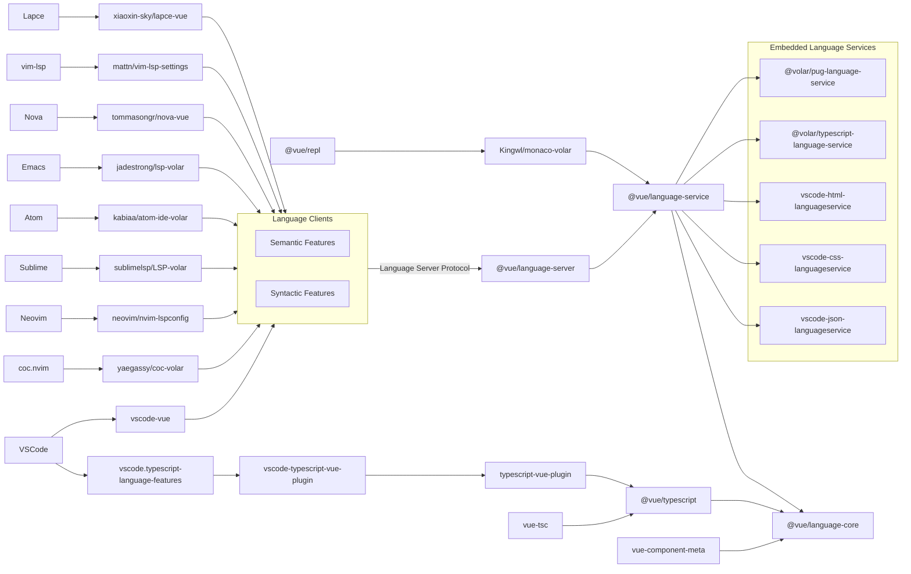

# What is vuejs/language-tools?

presentation for about vuejs/language-tools and Volar.js

## v-tokyo#20, karacoro / からころ

<div class="abs-br m-6 mr-18 flex gap-2">
  <a href="https://x.com/karan_corons" target="_blank" alt="X" title="Open in X"
    class="text-xl slidev-icon-btn opacity-50 !border-none !hover:text-white">
    <carbon-logo-x />
  </a>
</div>
<div class="abs-br m-6 flex gap-2">
  <a href="https://github.com/tsukuha" target="_blank" alt="GitHub" title="Open in GitHub"
    class="text-xl slidev-icon-btn opacity-50 !border-none !hover:text-white">
    <carbon-logo-github />
  </a>
</div>

<style>
.slidev-layout p {
  opacity: 0.7;
}
.h2 {
  opacity: 0.6;
}
</style>

---
layout: section-1
background: ./img/section-1.svg
---
# 本日のアジェンダ
1. はじめに
2. vuejs/language-toolsについて
3. LSP（Language Server Protocol）とは
4. 言語サーバー機能について
5. vue-tscで理解するvuejs/language-tools
6. おわりに

<div class="abs-br mr-2">
  <SlideCurrentNo class="counter" />
</div>

<style>
html {
  color: #3e3e3e;
}
html.dark {
  color: #efefef;
}
.counter {
  padding-bottom: 4px;
  font-family: "メイリオ";
  font-size: 12px;
}
h1 {
  background-image: linear-gradient(90deg, rgba(167, 199, 240, 1), rgba(178, 207, 249, 1) 0%, rgba(98, 166, 255, 1) 26%, rgba(28, 128, 238, 1) 70%);
  background-size: 100%;
  -webkit-background-clip: text;
  -moz-background-clip: text;
  -webkit-text-fill-color: transparent;
  -moz-text-fill-color: transparent;
  font-weight: 500;
  padding-bottom: 8px;
}
div, p, span, li {
  font-size: 24px;
}
</style>


---
transition: slide-up
layout: section-2
background: ./img/section-2.svg
---

# はじめに

## DX（開発者体験）との関係性
<div class="description">
vuejs/language-toolsは、VSCodeをはじめとしたIDEのVue.js用言語ツールに活用されていて、DXに貢献している。
</div>

## 今日話すこと・持ち帰って欲しいこと
- vuejs/language-tools について知る
- 言語サーバーとしてのvuejs/language-toolsの役割を理解する
- vue-tscを通して、型チェッカーとしてのvuejs/language-toolsの役割を理解する
- Volar.js と vuejs/language-tools の関係性を理解する


<div class="abs-br mr-2 counter">
  <SlideCurrentNo class="counter"/>
</div>

<style>
html {
  color: #3e3e3e;
}
html.dark {
  color: #efefef;
}
.counter {
  padding-bottom: 4px;
  font-family: "メイリオ";
  font-size: 12px;
}
.description {
  opacity: 0.8;
  padding-bottom: 16px;
}
h1 {
   background-image: linear-gradient(90deg, rgba(167, 199, 240, 1), rgba(178, 207, 249, 1) 0%, rgba(98, 166, 255, 1) 26%, rgba(28, 128, 238, 1) 70%);
  background-size: 100%;
  -webkit-background-clip: text;
  -moz-background-clip: text;
  -webkit-text-fill-color: transparent;
  -moz-text-fill-color: transparent;
  font-weight: 500;
  padding-bottom: 8px;
}
h2 {
  padding-bottom: 8px;
  font-size: 26px;
}
div, p, span, li, button, tr, td {
  font-size: 22px;
  line-height: 1.5;
}
</style>

---
transition: slide-up
layout: section-2
background: ./img/section-2.svg
---

# vuejs/language-toolsについて

## 概要
<div class="description">
vuejs/language-toolsはVue.js用の言語ツール群で、<br>
言語サーバー機能と型チェック機能の大きく2つの機能に分けられる。
</div>

- 言語サーバー機能に関するパッケージ例
  - `@vue/language-server`
  - `vite-plugin-vue-component-preview`
  - `@vue/typescript-plugin` .etc

- 型チェック機能に関するパッケージ例
  - `Vue Language Feature`
  - `vue-tsc` .etc
<div class="abs-br mr-2 counter">
  <SlideCurrentNo class="counter" />
</div>

<style>
html {
  color: #3e3e3e;
}
html.dark {
  color: #efefef;
}
.description {
  opacity: 0.8;
  padding-bottom: 8px;
}
.counter {
  padding-bottom: 4px;
  font-family: "メイリオ";
  font-size: 12px;
}
h1 {
   background-image: linear-gradient(90deg, rgba(167, 199, 240, 1), rgba(178, 207, 249, 1) 0%, rgba(98, 166, 255, 1) 26%, rgba(28, 128, 238, 1) 70%);
  background-size: 100%;
  -webkit-background-clip: text;
  -moz-background-clip: text;
  -webkit-text-fill-color: transparent;
  -moz-text-fill-color: transparent;
  font-weight: 500;
  padding-bottom: 8px;
}
h2 {
  padding-bottom: 8px;
  font-size: 26px;
}
div, p, span, li, button, tr, td {
  font-size: 22px;
  line-height: 1.5;
}
</style>

---
layout: statement
---




[ref: https://github.com/vuejs/language-tools?tab=readme-ov-file#high-level-system-overview](https://github.com/vuejs/language-tools?tab=readme-ov-file#high-level-system-overview)
<div class="abs-br mr-2 counter">
  <SlideCurrentNo class="counter" />
</div>

<style>
html {
  color: #3e3e3e;
}
html.dark {
  color: #efefef;
}
.counter {
  padding-bottom: 4px;
  font-family: "メイリオ";
  font-size: 12px;
}
h1 {
   background-image: linear-gradient(90deg, rgba(167, 199, 240, 1), rgba(178, 207, 249, 1) 0%, rgba(98, 166, 255, 1) 26%, rgba(28, 128, 238, 1) 70%);
  background-size: 100%;
  -webkit-background-clip: text;
  -moz-background-clip: text;
  -webkit-text-fill-color: transparent;
  -moz-text-fill-color: transparent;
  font-weight: 500;
  padding-bottom: 8px;
}
h2 {
  padding-bottom: 8px;
  font-size: 26px;
}
div, p, span, li, button, tr, td {
  font-size: 22px;
  line-height: 1.5;
}
a {
  opacity: 0.8;
  position: absolute;
  bottom: 8px;
  font-size: 12px;
}
</style>

---
layout: section-2
background: ./img/section-2.svg
---

# LSP（Language Server Protocol）とは

<div class="description">
LSP（Language Server Protocol）とは、Microsoft社がIDM開発者に向けて、<br>
2016年に発表した言語サーバ-を実現するための、JSON-RPCベースのプロトコル。<br>
vuejs/language-toolsもVue.js用の言語サーバーを含んでおり、LSPに則って実装<br>
されている。<br>
</div>

- VSCodeでVue.js用のExtensionsを適用すると言語サーバーの実プロセスが確認できる

```sh
69456 ?? 0:00.53 /Applications/Visual Studio Code.app/Contents/Frameworks/Code Helper
  (Plugin).app/Contents/MacOS/Code Helper (Plugin) 
  /Users/tsukuha/.vscode/extensions/vue.volar-2.0.19/server.js
  --node-ipc --clientProcessId=69377
```

[ref: https://microsoft.github.io/language-server-protocol/](https://microsoft.github.io/language-server-protocol/)
<div class="abs-br mr-2 counter">
  <SlideCurrentNo class="counter" />
</div>

<style>
html {
  color: #3e3e3e;
}
html.dark {
  color: #efefef;
}
.description {
  opacity: 0.8;
  padding-bottom: 8px;
}
.counter {
  padding-bottom: 4px;
  font-family: "メイリオ";
  font-size: 12px;
}
h1 {
   background-image: linear-gradient(90deg, rgba(167, 199, 240, 1), rgba(178, 207, 249, 1) 0%, rgba(98, 166, 255, 1) 26%, rgba(28, 128, 238, 1) 70%);
  background-size: 100%;
  -webkit-background-clip: text;
  -moz-background-clip: text;
  -webkit-text-fill-color: transparent;
  -moz-text-fill-color: transparent;
  font-weight: 500;
  padding-bottom: 8px;
}
h2 {
  padding-bottom: 8px;
  font-size: 26px;
}
div, p, span, li, button, tr, td {
  font-size: 22px;
  line-height: 1.5;
}
a {
  opacity: 0.8;
  position: absolute;
  bottom: 16px;
  font-size: 16px;
}
</style>

<!-- 用語: RPC（Remote Procedure Call） -->

---
transition: slide-up
layout: section-2
background: ./img/section-2.svg
---

# 言語サーバー機能について

## 概要
vuejs/language-toolsの、`@vue/language-server` に、LSPに則って処理を行う<br>
言語サーバーが実装されています。


[ref: https://github.com/vuejs/language-tools/blob/master/packages/language-server/node.ts](https://github.com/vuejs/language-tools/blob/master/packages/language-server/node.ts)
<div class="abs-br mr-2 counter">
  <SlideCurrentNo class="counter" />
</div>

<style>
html {
  color: #3e3e3e;
}
html.dark {
  color: #efefef;
}
.description {
  opacity: 0.8;
  padding-bottom: 8px;
}
.counter {
  padding-bottom: 4px;
  font-family: "メイリオ";
  font-size: 12px;
}
.slidev-layout p {
  margin-top: 0;
  opacity: 0.8;
}
h1 {
   background-image: linear-gradient(90deg, rgba(167, 199, 240, 1), rgba(178, 207, 249, 1) 0%, rgba(98, 166, 255, 1) 26%, rgba(28, 128, 238, 1) 70%);
  background-size: 100%;
  -webkit-background-clip: text;
  -moz-background-clip: text;
  -webkit-text-fill-color: transparent;
  -moz-text-fill-color: transparent;
  font-weight: 500;
  padding-bottom: 8px;
}
h2 {
  padding-bottom: 8px;
  font-size: 26px;
}
div, p, span, li, button, tr, td {
  font-size: 22px;
  line-height: 1.5;
}
a {
  opacity: 0.8;
  position: absolute;
  bottom: 16px;
  font-size: 16px;
}
</style>

---
layout: section-2
background: ./img/section-2.svg
---

# vue-tscで理解するvuejs/language-tools
## vue-tscの型チェッカー機能について
- vuejs/language-core
- Volar.js

## Volar.jsについて


[ref: https://github.com/volarjs/volar.js](https://github.com/volarjs/volar.js)

<div class="abs-br mr-2 counter">
  <SlideCurrentNo class="counter" />
</div>

<style>
html {
  color: #3e3e3e;
}
html.dark {
  color: #efefef;
}
.counter {
  padding-bottom: 4px;
  font-family: "メイリオ";
  font-size: 12px;
}
h1 {
   background-image: linear-gradient(90deg, rgba(167, 199, 240, 1), rgba(178, 207, 249, 1) 0%, rgba(98, 166, 255, 1) 26%, rgba(28, 128, 238, 1) 70%);
  background-size: 100%;
  -webkit-background-clip: text;
  -moz-background-clip: text;
  -webkit-text-fill-color: transparent;
  -moz-text-fill-color: transparent;
  font-weight: 500;
  padding-bottom: 8px;
}
h2 {
  padding-bottom: 8px;
  font-size: 26px;
}
div, p, span, li, button, tr, td {
  font-size: 22px;
  line-height: 1.5;
}
a {
  opacity: 0.8;
  position: absolute;
  bottom: 16px;
  font-size: 16px;
}
</style>

---
layout: section-2
background: ./img/section-2.svg
---

# vue-tscで理解するvuejs/language-tools

````md magic-move
```ts {*|1|2}
import { runTsc } from '@volar/typescript/lib/quickstart/runTsc';
import * as vue from '@vue/language-core';

const windowsPathReg = /\\/g;

export function run() {

	let runExtensions = ['.vue'];

	const extensionsChangedException = new Error('extensions changed');
	const main = () => runTsc(
		require.resolve('typescript/lib/tsc'),
		runExtensions,
		(ts, options) => {
			const { configFilePath } = options.options;
			const vueOptions = typeof configFilePath === 'string'
				? vue.createParsedCommandLine(ts, ts.sys, configFilePath.replace(windowsPathReg, '/')).vueOptions
				: vue.resolveVueCompilerOptions({});
        ...
```

````

[ref: https://github.com/vuejs/language-tools/blob/master/packages/tsc/index.ts](https://github.com/vuejs/language-tools/blob/master/packages/tsc/index.ts)

<div class="abs-br mr-2 counter">
  <SlideCurrentNo class="counter" />
</div>

<style>
html {
  color: #3e3e3e;
}
html.dark {
  color: #efefef;
}
.counter {
  padding-bottom: 4px;
  font-family: "メイリオ";
  font-size: 12px;
}
h1 {
   background-image: linear-gradient(90deg, rgba(167, 199, 240, 1), rgba(178, 207, 249, 1) 0%, rgba(98, 166, 255, 1) 26%, rgba(28, 128, 238, 1) 70%);
  background-size: 100%;
  -webkit-background-clip: text;
  -moz-background-clip: text;
  -webkit-text-fill-color: transparent;
  -moz-text-fill-color: transparent;
  font-weight: 500;
  padding-bottom: 8px;
}
h2 {
  padding-bottom: 8px;
  font-size: 26px;
}
.slidev-layout h1 p {
  opacity: 0.8;
}
div, p, span, li, button, tr, td {
  font-size: 22px;
  line-height: 1.5;
}
a {
  opacity: 0.8;
  position: absolute;
  bottom: 16px;
  font-size: 16px;
}
</style>

---
layout: section-two-cols
---

# vue-tscで理解するvuejs/language-tools
Vue3.3で利用できるようになったdefineSlots()マクロを例にします。

<template v-slot:header>
</template>

<template v-slot:left>
<p class="file-name">SlotsTestChild.vue</p>
```vue
<script setup lang="ts">
import type { Item } from '../pages/index.vue'
defineProps<{
  body: Item['body'],
  username: Item['username'],
  likes: Item['likes'],
}>()
</script>

<template>
  <li>
    <p>{{ username }}</p>
    <p>{{ likes }}</p>
  </li>
</template>
```
</template>

<template v-slot:right>
<p class="file-name">ChildSlots.vue</p>
```vue
<script setup lang="ts">
import type { Item } from '../pages/index.vue'
defineProps<{
  items: Item[]
}>()
defineSlots<{
  item: (props: Item) => unknown
}>()
</script>

<template>
  <ul v-for="item in items">
    <slot
      name="item"
      v-bind="item"
    />
  </ul>
</template>
```
</template>


<div class="abs-br mr-2 counter">
  <SlideCurrentNo class="counter" />
</div>

<style>
html {
  color: #3e3e3e;
}
html.dark {
  color: #efefef;
}
.counter {
  padding-bottom: 4px;
  font-family: "メイリオ";
  font-size: 12px;
}
.file-name {
  font-size: 22px
}
.empty {
  height: 22px;
  padding-bottom: 4px;
}
.wrapper {
  display: flex;
  width: 100%
}
.col {
  width: 50%
}
h1 {
  background-image: linear-gradient(90deg, rgba(167, 199, 240, 1), rgba(178, 207, 249, 1) 0%, rgba(98, 166, 255, 1) 26%, rgba(28, 128, 238, 1) 70%);
  background-size: 100%;
  -webkit-background-clip: text;
  -moz-background-clip: text;
  -webkit-text-fill-color: transparent;
  -moz-text-fill-color: transparent;
  font-weight: 500;
  padding-bottom: 8px;
}
h2 {
  padding-bottom: 8px;
  font-size: 26px;
}
div, p, span, li, button, tr, td {
  font-size: 14px;
}
a {
  opacity: 0.8;
  position: absolute;
  bottom: 8px;
  font-size: 12px;
}
</style>

---
layout: section-two-cols
---

# vue-tscで理解するvuejs/language-tools
Vue3.3で利用できるようになったdefineSlots()マクロを例にします。

<template v-slot:header>
```sh
npx vue-tsc --noEmit pages/index.vue
```
</template>

<template v-slot:left>
<p class="file-name">index.vue (error)</p>

```vue {*|12}
<script setup lang="ts">
import SlotTestChild from '../../components/SlotTestChild.vue'
import ChildSlots from '../../components/ChildSlots.vue'
export interface Item {
  body: Record<string, string>
  username: string
  likes: number
}
const items = [
  {
    body: { id: 'aaaa' },
    username: 1024,
    likes: 1,
  },
]
</script>
```
</template>

<template v-slot:right>
<p class="empty"></p>

```vue {*|3,5}
<template>
  <div>
    <ChildSlots :items>
      <template #item="{ body, username, likes }">
        <SlotTestChild
          :body
          :username
        />
      </template>
    </ChildSlots>
  </div>
</template>
```
</template>

<div class="abs-br mr-2 counter">
  <SlideCurrentNo class="counter" />
</div>

<style>
html {
  color: #3e3e3e;
}
html.dark {
  color: #efefef;
}
.counter {
  padding-bottom: 4px;
  font-family: "メイリオ";
  font-size: 12px;
}
.file-name {
  font-size: 22px;
}
.empty {
  height: 22px;
  padding-bottom: 4px;
}
.wrapper {
  display: flex;
  width: 100%
}
.col {
  width: 50%
}
h1 {
  background-image: linear-gradient(90deg, rgba(167, 199, 240, 1), rgba(178, 207, 249, 1) 0%, rgba(98, 166, 255, 1) 26%, rgba(28, 128, 238, 1) 70%);
  background-size: 100%;
  -webkit-background-clip: text;
  -moz-background-clip: text;
  -webkit-text-fill-color: transparent;
  -moz-text-fill-color: transparent;
  font-weight: 500;
  padding-bottom: 8px;
}
h2 {
  padding-bottom: 8px;
  font-size: 26px;
}
div, p, span, li, button, tr, td {
  font-size: 14px;
}
a {
  opacity: 0.8;
  position: absolute;
  bottom: 8px;
  font-size: 12px;
}
</style>

---
layout: section-two-cols
image: ./img/error_sample_slots.png
---

# vue-tscで理解するvuejs/language-tools

<template v-slot:header>
```sh
npx vue-tsc --noEmit pages/index.vue
```
</template>

<template v-slot:left>

## `defineSlots()` の型チェック例

<div class="description">
ChildSlots.vueで定義している型と<br>
propsで渡しているitemsの型とSlotTestsChild<br>
の型がコンフリクトを起こしているため、<br>
該当箇所でエラーが発生していることが<br>
わかります。
</div>

</template>

<div class="abs-br mr-2 counter">
  <SlideCurrentNo class="counter" />
</div>

<style>
html {
  color: #3e3e3e;
}
html.dark {
  color: #efefef;
}
.description {
  border-radius: 6px;
  background: rgba(178, 207, 249, 0.3);
  margin-top: 16px;
  padding: 8px;
  opacity: 0.8;
  font-size: 20px;
}
.counter {
  padding-bottom: 4px;
  font-family: "メイリオ";
  font-size: 12px;
}
.file-name {
  font-size: 22px;
}
.empty {
  height: 22px;
  padding-bottom: 4px;
}
.wrapper {
  display: flex;
  width: 100%
}
.col {
  width: 50%
}
h1 {
  background-image: linear-gradient(90deg, rgba(167, 199, 240, 1), rgba(178, 207, 249, 1) 0%, rgba(98, 166, 255, 1) 26%, rgba(28, 128, 238, 1) 70%);
  background-size: 100%;
  -webkit-background-clip: text;
  -moz-background-clip: text;
  -webkit-text-fill-color: transparent;
  -moz-text-fill-color: transparent;
  font-weight: 500;
  padding-bottom: 8px;
}
h2 {
  padding-top: 8px;
  padding-bottom: 8px;
  font-size: 26px;
}
div, p, span, li, button, tr, td {
  font-size: 14px;
  line-height: 1.5;
}
a {
  opacity: 0.8;
  position: absolute;
  bottom: 8px;
  font-size: 12px;
}
</style>
